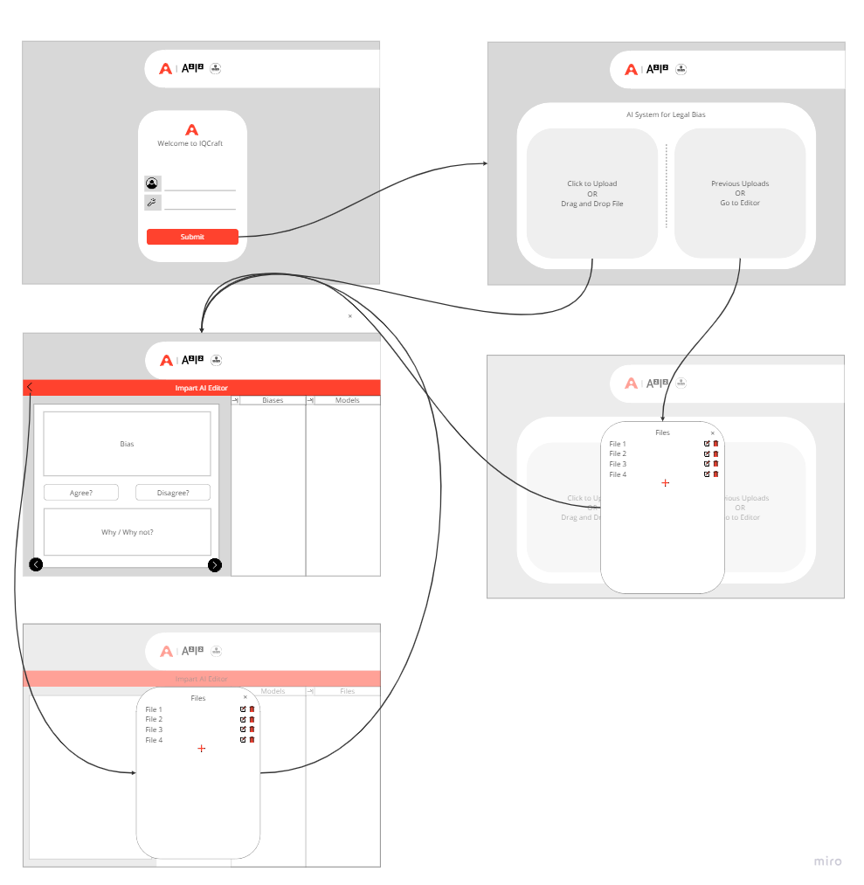

# iqcraft

# Folder Structure
```
iqcraft/
│
├── iqcraft/
│   ├── __init__.py
│   ├── settings.py  # database configuration, static file locations, other settings go here
│   ├── urls.py      # 
│   └── wsgi.py      # 
│
├── impart/
│   ├── migrations/
│   ├── static/
│   ├── templates/
│   ├── clients/
│   │   ├── __init__.py
│   │   └── clients.py  # python code to connect to public AI providers to generate outputs
│   │
│   ├── __init__.py  #
│   ├── admin.py     #
│   ├── apps.py      #
│   ├── models.py    # classes to control updates to database
│   ├── tests.py     # 
│   └── views.py     # website API endpoints
│
├── templates/  # different html pages 
│   ├── base.html    # simple page which imports the html css, parts common across website (header navigataion session etc)
│   ├── login.html   # login page
│   ├── home.html    # basic page that allows uploading documents
│   └── editor.html  # the window where they can annotate model responses
│
├── static/  # common files that modify the appearance of the website
│   ├── css/
│   ├── js/
│   └── img/
│
├── documents/  # uploaded files are saved in this folder
│
└── manage.py
```

# Wireframe



[Link](https://miro.com/app/board/uXjVNRZxJC4=/)

